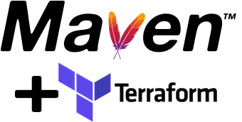

The Home of RuleBook and The Terraform Maven Plugin

# RuleBook
 RuleBook provides a simple, but powerful and flexible rules abstraction that has an incredibly short learning curve.
With RuleBook, there’s no guesswork or unpredictable behavior, which means developers can spend more time creating useful functionality. And unlike many other rules engines, RuleBook can be used to drive workflows, where the ordering of rules is important. So, start simplifying your life and streamlining your code. Start using RuleBook today!

<a href="https://github.com/deliveredtechnologies/rulebook">RuleBook on GitHub</a>

# Terraform Maven Plugin
The Terraform Maven Plugin brings Maven to Terraform and greatly enhances the Terraform project lifecycle and dependency management experience. Maven in some form has been the standard for Java project management for over a decade. Now, all of that Maven goodness can be used with Terraform!

<a href="https://github.com/deliveredtechnologies/terraform-maven">Terraform Maven Plugin on GitHub</a>